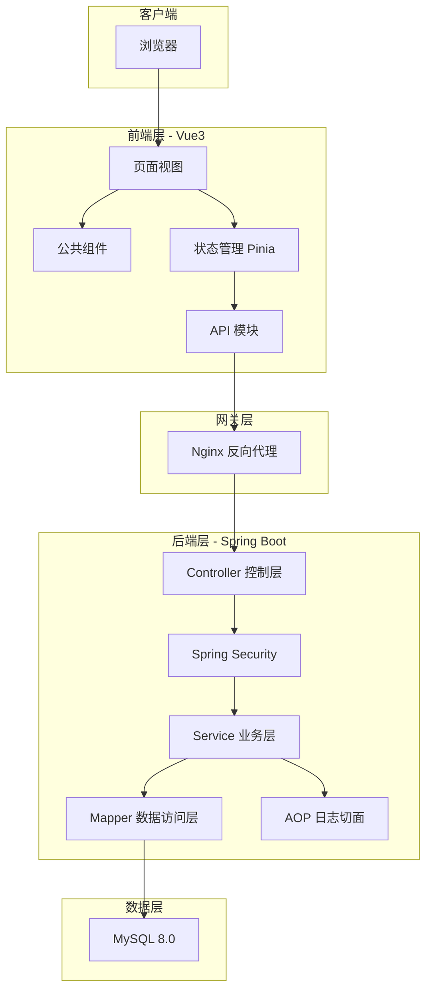
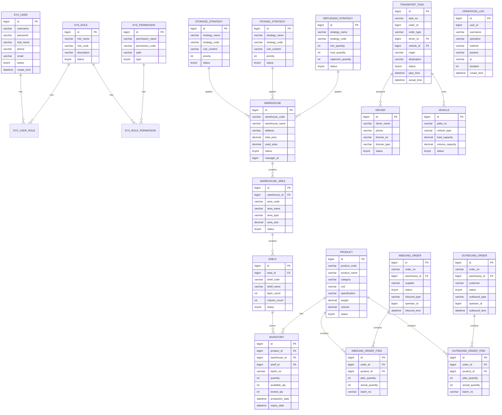

# 物流仓库管理系统 - 项目设计文档

## 1. 系统架构



## 2. ER 图



## 3. 接口清单

### 3.1 认证模块 (AuthController)

| 方法 | 路径 | 描述 |
|------|------|------|
| POST | /api/auth/login | 用户登录 |
| POST | /api/auth/logout | 用户登出 |
| GET | /api/auth/info | 获取当前用户信息 |

### 3.2 用户管理 (UserController)

| 方法 | 路径 | 描述 |
|------|------|------|
| GET | /api/users | 分页查询用户列表 |
| GET | /api/users/{id} | 获取用户详情 |
| POST | /api/users | 新增用户 |
| PUT | /api/users/{id} | 更新用户 |
| DELETE | /api/users/{id} | 删除用户 |
| PUT | /api/users/{id}/status | 更新用户状态 |

### 3.3 角色管理 (RoleController)

| 方法 | 路径 | 描述 |
|------|------|------|
| GET | /api/roles | 分页查询角色列表 |
| GET | /api/roles/all | 获取所有角色 |
| POST | /api/roles | 新增角色 |
| PUT | /api/roles/{id} | 更新角色 |
| DELETE | /api/roles/{id} | 删除角色 |
| PUT | /api/roles/{id}/permissions | 分配权限 |

### 3.4 库房管理 (WarehouseController)

| 方法 | 路径 | 描述 |
|------|------|------|
| GET | /api/warehouses | 分页查询库房列表 |
| GET | /api/warehouses/all | 获取所有库房 |
| GET | /api/warehouses/{id} | 获取库房详情 |
| POST | /api/warehouses | 新增库房 |
| PUT | /api/warehouses/{id} | 更新库房 |
| DELETE | /api/warehouses/{id} | 删除库房 |
| GET | /api/warehouses/{id}/stats | 获取库房统计信息 |

### 3.5 区域管理 (AreaController)

| 方法 | 路径 | 描述 |
|------|------|------|
| GET | /api/areas | 分页查询区域列表 |
| GET | /api/areas/warehouse/{warehouseId} | 获取库房下所有区域 |
| POST | /api/areas | 新增区域 |
| PUT | /api/areas/{id} | 更新区域 |
| DELETE | /api/areas/{id} | 删除区域 |

### 3.6 货架管理 (ShelfController)

| 方法 | 路径 | 描述 |
|------|------|------|
| GET | /api/shelves | 分页查询货架列表 |
| GET | /api/shelves/area/{areaId} | 获取区域下所有货架 |
| POST | /api/shelves | 新增货架 |
| PUT | /api/shelves/{id} | 更新货架 |
| DELETE | /api/shelves/{id} | 删除货架 |

### 3.7 商品管理 (ProductController)

| 方法 | 路径 | 描述 |
|------|------|------|
| GET | /api/products | 分页查询商品列表 |
| GET | /api/products/all | 获取所有商品 |
| GET | /api/products/{id} | 获取商品详情 |
| POST | /api/products | 新增商品 |
| PUT | /api/products/{id} | 更新商品 |
| DELETE | /api/products/{id} | 删除商品 |

### 3.8 库存管理 (InventoryController)

| 方法 | 路径 | 描述 |
|------|------|------|
| GET | /api/inventory | 分页查询库存列表 |
| GET | /api/inventory/product/{productId} | 查询商品库存 |
| GET | /api/inventory/warehouse/{warehouseId} | 查询库房库存 |
| POST | /api/inventory/adjust | 库存调整 |
| GET | /api/inventory/warning | 库存预警列表 |

### 3.9 入库管理 (InboundController)

| 方法 | 路径 | 描述 |
|------|------|------|
| GET | /api/inbound | 分页查询入库单列表 |
| GET | /api/inbound/{id} | 获取入库单详情 |
| POST | /api/inbound | 创建入库单 |
| PUT | /api/inbound/{id} | 更新入库单 |
| POST | /api/inbound/{id}/confirm | 确认入库 |
| POST | /api/inbound/{id}/cancel | 取消入库单 |

### 3.10 出库管理 (OutboundController)

| 方法 | 路径 | 描述 |
|------|------|------|
| GET | /api/outbound | 分页查询出库单列表 |
| GET | /api/outbound/{id} | 获取出库单详情 |
| POST | /api/outbound | 创建出库单 |
| PUT | /api/outbound/{id} | 更新出库单 |
| POST | /api/outbound/{id}/audit | 审核出库单 |
| POST | /api/outbound/{id}/confirm | 确认出库 |
| POST | /api/outbound/{id}/cancel | 取消出库单 |

### 3.11 策略管理 (StrategyController)

| 方法 | 路径 | 描述 |
|------|------|------|
| GET | /api/strategies/storage | 分页查询存储策略 |
| POST | /api/strategies/storage | 新增存储策略 |
| PUT | /api/strategies/storage/{id} | 更新存储策略 |
| DELETE | /api/strategies/storage/{id} | 删除存储策略 |
| GET | /api/strategies/picking | 分页查询拣货策略 |
| POST | /api/strategies/picking | 新增拣货策略 |
| PUT | /api/strategies/picking/{id} | 更新拣货策略 |
| DELETE | /api/strategies/picking/{id} | 删除拣货策略 |
| GET | /api/strategies/replenish | 分页查询补货策略 |
| POST | /api/strategies/replenish | 新增补货策略 |
| PUT | /api/strategies/replenish/{id} | 更新补货策略 |
| DELETE | /api/strategies/replenish/{id} | 删除补货策略 |

### 3.12 运输调度 (TransportController)

| 方法 | 路径 | 描述 |
|------|------|------|
| GET | /api/transport/tasks | 分页查询运输任务 |
| GET | /api/transport/tasks/{id} | 获取任务详情 |
| POST | /api/transport/tasks | 创建运输任务 |
| PUT | /api/transport/tasks/{id} | 更新运输任务 |
| POST | /api/transport/tasks/{id}/assign | 分配任务 |
| POST | /api/transport/tasks/{id}/start | 开始任务 |
| POST | /api/transport/tasks/{id}/complete | 完成任务 |
| POST | /api/transport/tasks/{id}/cancel | 取消任务 |

### 3.13 司机管理 (DriverController)

| 方法 | 路径 | 描述 |
|------|------|------|
| GET | /api/drivers | 分页查询司机列表 |
| GET | /api/drivers/available | 获取可用司机 |
| POST | /api/drivers | 新增司机 |
| PUT | /api/drivers/{id} | 更新司机 |
| DELETE | /api/drivers/{id} | 删除司机 |

### 3.14 车辆管理 (VehicleController)

| 方法 | 路径 | 描述 |
|------|------|------|
| GET | /api/vehicles | 分页查询车辆列表 |
| GET | /api/vehicles/available | 获取可用车辆 |
| POST | /api/vehicles | 新增车辆 |
| PUT | /api/vehicles/{id} | 更新车辆 |
| DELETE | /api/vehicles/{id} | 删除车辆 |

### 3.15 报表管理 (ReportController)

| 方法 | 路径 | 描述 |
|------|------|------|
| GET | /api/reports/inventory/summary | 库存汇总报表 |
| GET | /api/reports/inventory/detail | 库存明细报表 |
| GET | /api/reports/inbound/summary | 入库汇总报表 |
| GET | /api/reports/outbound/summary | 出库汇总报表 |
| GET | /api/reports/turnover | 周转率分析报表 |
| GET | /api/reports/warning | 异常预警报表 |
| GET | /api/reports/export | 导出报表 |

### 3.16 操作日志 (LogController)

| 方法 | 路径 | 描述 |
|------|------|------|
| GET | /api/logs | 分页查询操作日志 |
| GET | /api/logs/export | 导出操作日志 |

## 4. UI/UX 规范

### 4.1 色彩规范

```scss
// 主色调
$primary-color: #409EFF;
$primary-light: #66B1FF;
$primary-dark: #3A8EE6;

// 功能色
$success-color: #67C23A;
$warning-color: #E6A23C;
$danger-color: #F56C6C;
$info-color: #909399;

// 中性色
$text-primary: #303133;
$text-regular: #606266;
$text-secondary: #909399;
$text-placeholder: #C0C4CC;

// 边框色
$border-base: #DCDFE6;
$border-light: #E4E7ED;
$border-lighter: #EBEEF5;
$border-extra-light: #F2F6FC;

// 背景色
$bg-color: #F5F7FA;
$bg-white: #FFFFFF;
$bg-dark: #303133;
```

### 4.2 字体规范

```scss
// 字体家族
$font-family: 'Helvetica Neue', Helvetica, 'PingFang SC', 'Hiragino Sans GB', 'Microsoft YaHei', Arial, sans-serif;

// 字号
$font-size-large: 18px;
$font-size-medium: 16px;
$font-size-base: 14px;
$font-size-small: 13px;
$font-size-mini: 12px;

// 行高
$line-height-base: 1.5;
$line-height-tight: 1.3;
```

### 4.3 间距规范

```scss
// 间距
$spacing-mini: 4px;
$spacing-small: 8px;
$spacing-base: 16px;
$spacing-medium: 24px;
$spacing-large: 32px;
$spacing-xlarge: 48px;
```

### 4.4 圆角规范

```scss
// 圆角
$border-radius-small: 2px;
$border-radius-base: 4px;
$border-radius-medium: 8px;
$border-radius-large: 12px;
$border-radius-round: 20px;
```

### 4.5 阴影规范

```scss
// 阴影
$box-shadow-base: 0 2px 4px rgba(0, 0, 0, 0.12), 0 0 6px rgba(0, 0, 0, 0.04);
$box-shadow-light: 0 2px 12px 0 rgba(0, 0, 0, 0.1);
$box-shadow-dark: 0 4px 16px rgba(0, 0, 0, 0.16);
```

### 4.6 组件规范

#### 按钮
- 主按钮：蓝色背景，白色文字
- 成功按钮：绿色背景，白色文字
- 警告按钮：橙色背景，白色文字
- 危险按钮：红色背景，白色文字
- Hover 状态：颜色加深10%，添加阴影
- Loading 状态：显示加载图标，禁用点击

#### 表格
- 表头背景色：#F5F7FA
- 斑马纹：奇数行 #FAFAFA
- 悬停效果：行背景色变为 #F5F7FA
- 边框：1px solid #EBEEF5

#### 卡片
- 背景色：#FFFFFF
- 边框：1px solid #EBEEF5
- 圆角：8px
- 阴影：box-shadow-light

#### 表单
- 标签宽度：统一 100px
- 输入框高度：40px
- 下拉框最小宽度：200px
- 验证错误提示：红色文字

### 4.7 响应式断点

```scss
// 响应式断点
$breakpoint-xs: 480px;
$breakpoint-sm: 576px;
$breakpoint-md: 768px;
$breakpoint-lg: 992px;
$breakpoint-xl: 1200px;
$breakpoint-xxl: 1600px;
```

## 5. 数据字典

### 5.1 用户状态 (user_status)
| 值 | 描述 |
|----|------|
| 0 | 禁用 |
| 1 | 启用 |

### 5.2 库房状态 (warehouse_status)
| 值 | 描述 |
|----|------|
| 0 | 停用 |
| 1 | 启用 |

### 5.3 区域类型 (area_type)
| 值 | 描述 |
|----|------|
| STORAGE | 存储区 |
| PICKING | 拣货区 |
| RECEIVING | 收货区 |
| SHIPPING | 发货区 |
| TEMPORARY | 暂存区 |

### 5.4 入库单状态 (inbound_status)
| 值 | 描述 |
|----|------|
| 0 | 草稿 |
| 1 | 待入库 |
| 2 | 入库中 |
| 3 | 已完成 |
| 4 | 已取消 |

### 5.5 出库单状态 (outbound_status)
| 值 | 描述 |
|----|------|
| 0 | 草稿 |
| 1 | 待审核 |
| 2 | 已审核 |
| 3 | 拣货中 |
| 4 | 已出库 |
| 5 | 已取消 |

### 5.6 运输任务状态 (transport_status)
| 值 | 描述 |
|----|------|
| 0 | 待分配 |
| 1 | 已分配 |
| 2 | 运输中 |
| 3 | 已完成 |
| 4 | 已取消 |

### 5.7 策略状态 (strategy_status)
| 值 | 描述 |
|----|------|
| 0 | 禁用 |
| 1 | 启用 |

### 5.8 车辆状态 (vehicle_status)
| 值 | 描述 |
|----|------|
| 0 | 停用 |
| 1 | 空闲 |
| 2 | 使用中 |
| 3 | 维修中 |

### 5.9 司机状态 (driver_status)
| 值 | 描述 |
|----|------|
| 0 | 离职 |
| 1 | 空闲 |
| 2 | 任务中 |
| 3 | 休假 |
